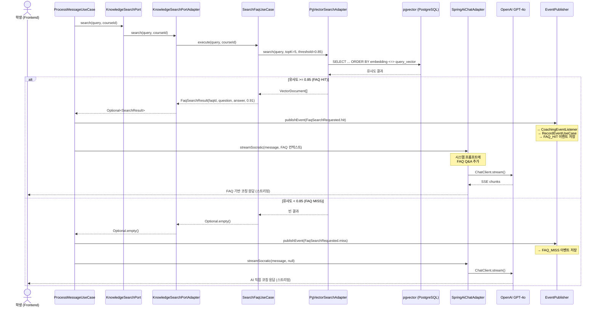
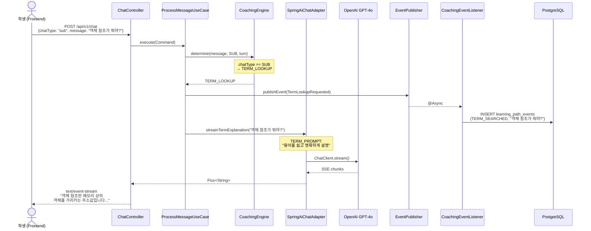
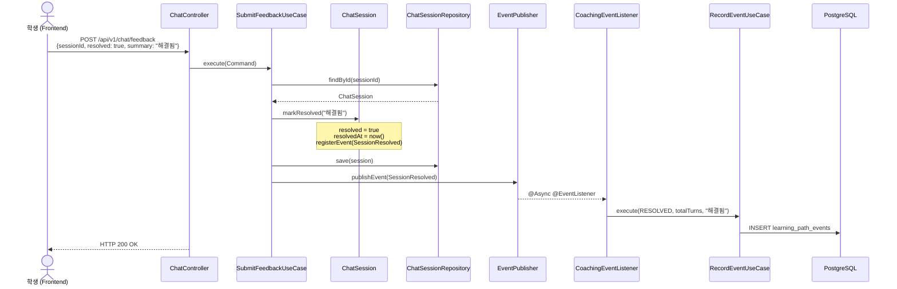
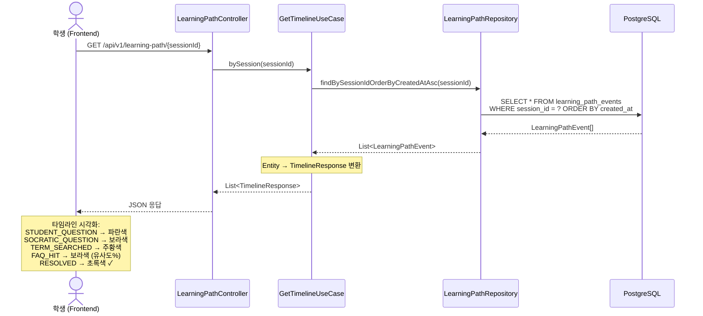
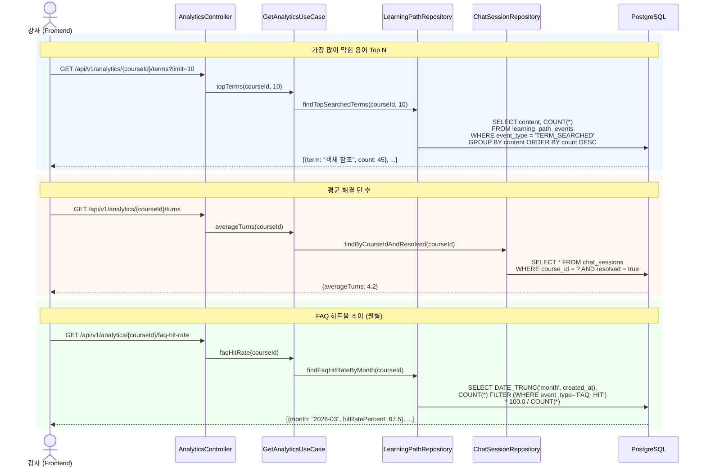
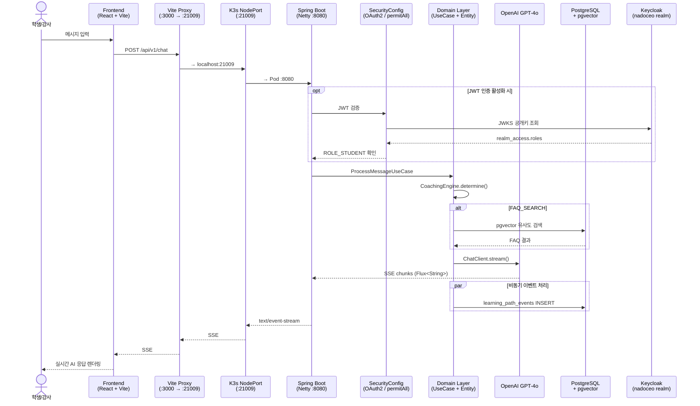
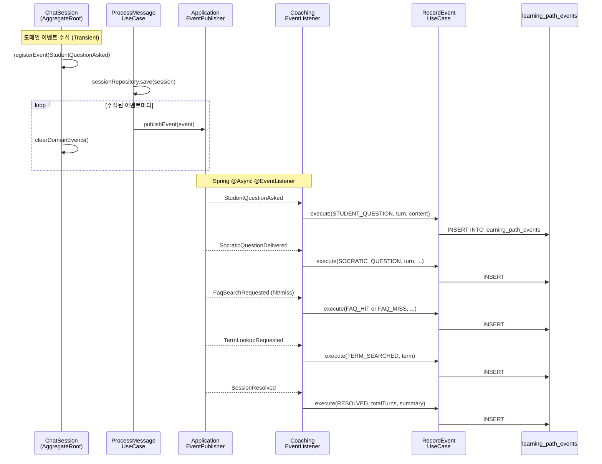

# NADOCEO 시스템 시퀀스 다이어그램

> 전체 시스템의 핵심 플로우를 Mermaid 시퀀스 다이어그램으로 정리합니다.

---

## 1. 소크라테스식 코칭 플로우 (Main Chat)

학생이 질문을 보내면 CoachingEngine이 메시지를 분석하여 코칭 상태를 결정하고, 상태에 따라 다른 처리 경로를 탑니다.

```mermaid
sequenceDiagram
    actor Student as 학생 (Frontend)
    participant Controller as ChatController
    participant UseCase as ProcessMessageUseCase
    participant Engine as CoachingEngine
    participant Session as ChatSession
    participant AI as SpringAiChatAdapter
    participant GPT as OpenAI GPT-4o
    participant Publisher as EventPublisher
    participant Listener as CoachingEventListener
    participant Record as RecordEventUseCase
    participant DB as PostgreSQL

    Student->>Controller: POST /api/v1/chat (SSE)
    Controller->>UseCase: execute(Command)

    UseCase->>Session: findOrCreate(sessionId)
    Session-->>UseCase: ChatSession

    UseCase->>Session: recordQuestion(message)
    Note over Session: advanceTurn() + <br/>registerEvent(StudentQuestionAsked)

    UseCase->>Engine: determine(message, chatType, turn)
    Engine-->>UseCase: CoachingState

    UseCase->>DB: sessionRepository.save(session)
    UseCase->>Publisher: publishEvent(StudentQuestionAsked)
    Publisher-->>Listener: @Async @EventListener
    Listener->>Record: execute(STUDENT_QUESTION, ...)
    Record->>DB: learning_path_events INSERT

    alt CoachingState = SOCRATIC
        UseCase->>AI: streamSocratic(message, null)
        AI->>GPT: ChatClient.stream()
        GPT-->>AI: SSE chunks
        AI-->>Controller: Flux<String>
        Controller-->>Student: text/event-stream (실시간)
        Note over UseCase: onComplete →
        UseCase->>Publisher: publishEvent(SocraticQuestionDelivered)
    else CoachingState = FAQ_SEARCH
        ref over UseCase: FAQ 검색 플로우 (아래 참조)
    else CoachingState = CONTINUE
        UseCase->>AI: streamSocratic(message, null)
        AI-->>Controller: Flux<String>
        Controller-->>Student: text/event-stream
    else CoachingState = TERM_LOOKUP
        ref over UseCase: 용어 검색 플로우 (아래 참조)
    end
```

---

## 2. FAQ 벡터 검색 플로우

CoachingState가 FAQ_SEARCH일 때, pgvector에서 유사도 검색을 수행하고 히트/미스에 따라 분기합니다.



---

## 3. 용어 검색 플로우 (Sub Chat)

오른쪽 패널에서 학생이 용어/개념을 검색하면, TERM_LOOKUP 상태로 처리됩니다.



---

## 4. 피드백 & 세션 해결 플로우

학생이 "해결완료" 버튼을 누르면 세션이 resolved 상태로 전환되고 도메인 이벤트가 발행됩니다.



---

## 5. 학습 경로 타임라인 조회 (학생 복습)

학생이 이전 코칭 세션의 학습 경로를 타임라인으로 복습합니다.



---

## 6. 강사 분석 API 플로우

강사가 과목별 학습 분석 데이터를 조회합니다.



---

## 7. 전체 시스템 아키텍처 흐름

프론트엔드부터 DB까지 전체 요청 흐름을 요약합니다.



---

## 8. Domain Event 흐름

coaching 컨텍스트에서 발행된 도메인 이벤트가 analytics 컨텍스트로 전달되는 과정입니다.


